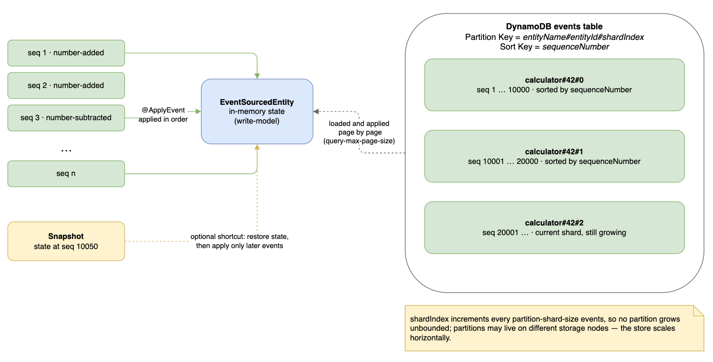
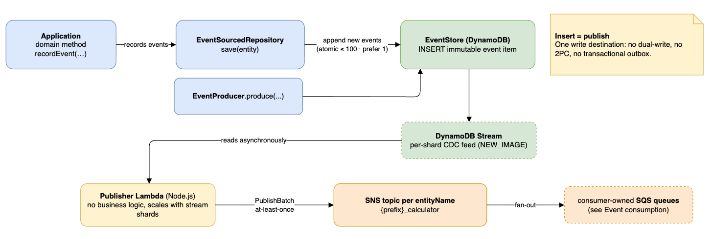
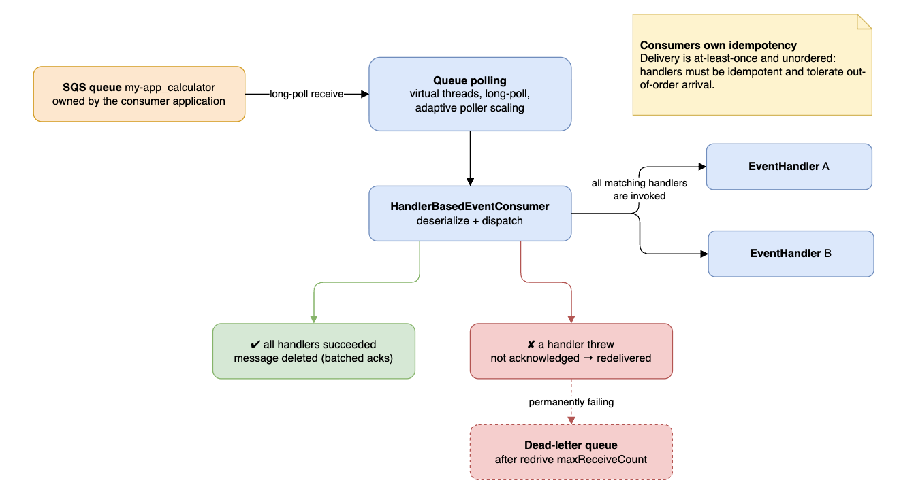
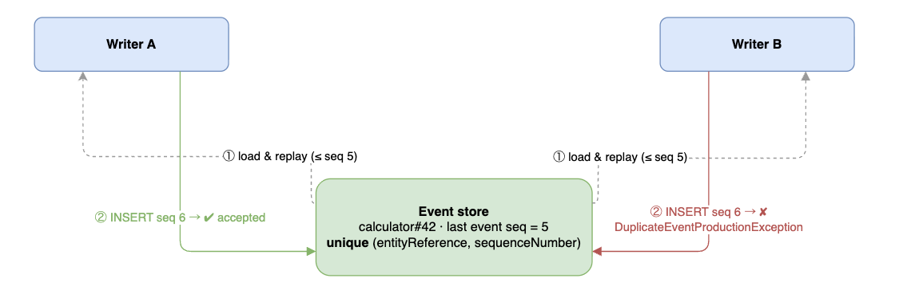
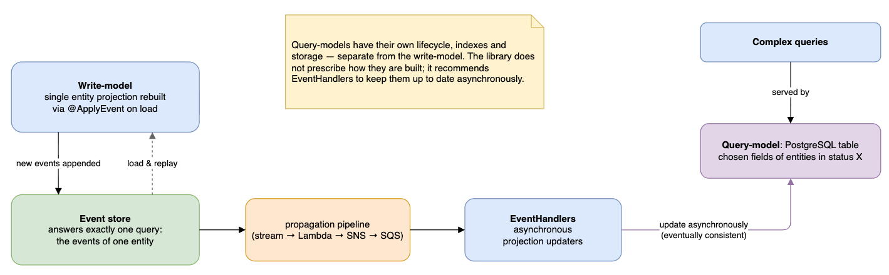
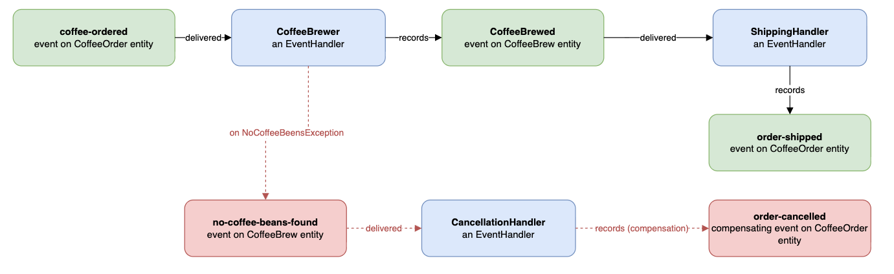

# Events Caravan

[](LICENSE)


[](https://central.sonatype.com/artifact/dev.baitursinov/events-caravan-core)

Event-sourcing framework designed for scalability & performance, while relying on eventual consistency. The core is
technology-agnostic and every integration point is an interface that can be implemented for any database and message
broker fitting the framework's philosophy and contracts. Adapters for
[AWS DynamoDB, SNS/SQS](#i-modules-and-dependencies) are shipped as
a [reference implementation](#why-the-reference-implementation-is-on-aws-why-it-suits-the-projects-philosophy-and-what-could-substitute-it).

## Contents

- [Philosophy in principles](#philosophy-in-principles)
- [Design and Architecture](#design-and-architecture)
    - [Event structure](#event-structure)
    - [Event sourcing and storage](#event-sourcing-and-storage)
    - [Producing and propagating events](#producing-and-propagating-events)
    - [Event consumption](#event-consumption)
    - [Optimistic concurrency control](#optimistic-concurrency-control)
    - [CQRS](#cqrs-command-query-responsibility-segregation)
    - [Compromises](#compromises)
    - [Sagas](#sagas)
- [User guide](#user-guide)
    - [I. Modules and dependencies](#i-modules-and-dependencies)
    - [II. Register your Events](#ii-register-your-events)
    - [III. Define an Event-sourced-entity](#iii-define-an-event-sourced-entity)
    - [IV. Set up an Event-sourced-repository](#iv-set-up-an-event-sourced-repository)
    - [V. Set up optional Snapshot-takers](#v-set-up-optional-snapshot-takers)
    - [VI. Set up Event-handlers](#vi-set-up-event-handlers)
    - [VII. Set up an optional Entity-stream](#vii-set-up-an-optional-entity-stream)
    - [VIII. Configure via application properties](#viii-configure-via-application-properties)
    - [IX. Infrastructure](#ix-infrastructure)
- [Why the reference implementation is on AWS](#why-the-reference-implementation-is-on-aws-why-it-suits-the-projects-philosophy-and-what-could-substitute-it)
- [When to choose Events-caravan over Axon](#when-to-choose-events-caravan-over-axon)
- [Q&A](#qa)
- [Yet to be built](#yet-to-be-built)
- [Contributing](#contributing)
- [Further reading](#further-reading)
- [License](#license)

## Philosophy in principles

1. **Aim for horizontal scalability.** Anything that must be "the one" instance eventually becomes the ceiling.
   Partition the data, avoid hot partitions, shard.
2. **Rely only on simple and cheap technology features.** Prefer
   [smart endpoints and dumb pipes](https://martinfowler.com/articles/microservices.html#SmartEndpointsAndDumbPipes):
   no central orchestrator for business or technical processes, no broker that has to understand your domain. This makes
   it easy for the utilized technology to scale.
3. **Have one write destination for each operation result,** between databases and message brokers, so there is no
   problem coordinating writes between multiple destinations and necessity to span transactions across them.
4. **Be satisfied with Eventual Consistency** beyond the single entity, in the sense of
   [Werner Vogels' "Eventually Consistent"](https://dl.acm.org/doi/10.1145/1466443.1466448). The entity (aggregate root)
   is the only unit of strong consistency, as in
   [Pat Helland's "Life beyond Distributed Transactions"](https://queue.acm.org/detail.cfm?id=3025012).
5. **Stay available.** Build processes modifying one entity at a time, asynchronous to each other. Do not hold locks.
6. **Make compromises visible for devs.** Where a guarantee is traded away (ordering, exactly-once delivery, strong
   consistency, small consistency units), developers are informed explicitly and are given the tools to compensate.
7. **Produced data must be durable.** An event written to the store survives anything short of losing the store itself;
   Events must be delivered and processed by consumers at least once.
8. **Be ready for a failure.** Software and hardware may break mid-process. Make every process recoverable. After a
   failure a retry should happen and finish the job without leaving the system in inconsistent state.
9. **Simple is secure.** Design simple solutions. Utilize few dependencies.
10. **Modules should be substitutable.** Every integration point (`EventStore`, `EventProducer`,
    `SnapshotStore`, (de)serializers, the polling transport, the events publisher) is an interface, implementations of
    which could vary.
11. **Developer experience is important.** Events-caravan provides simple interfaces, no DSL, which help devs to stay
    focused on building domain behavior; framework has no complex mechanisms that require configuring, and it fails fast
    when misconfigured.

## Design and Architecture

### Event structure

```json
{
  "entityReference": {
    "entityName": "calculator",
    "entityId": "1123456"
  },
  "eventName": "number-added",
  "sequenceNumber": 15,
  "timestamp": "2025-10-20T10:20:30.000Z",
  "payload": {
    "number": 101
  }
}
```

`EventType` and its payload are defined by combination of `entityName` and `eventName`. Payload class has to
be [registered](#ii-register-your-events).

### Event sourcing and storage



1. `EventSourcedEntity` derives its current state from all the events that happened to it.
   See [usage](#iii-define-an-event-sourced-entity)
2. Each Entity is identified by a `EntityReference`, which is a combination of `entityName` and `entityId`.
3. Each Event recorded on an Entity is identified by a combination of `EntityReference` and `sequenceNumber`.
4. Each Event has its `eventName`, which identifies how it alters state of an entity when applied on it.
5. Events are gaplessly sequenced per each entity starting from `sequenceNumber` 1.
6. `EntityReference` defines a partition where its events are stored.
7. As an entity is the only unit of strong consistency per projects philosophy, the underlying event store reserves its
   freedom to store each partition in different machines for scaling horizontally freely.
8. For entities with long histories [Snapshotting](#v-set-up-optional-snapshot-takers) can be utilized to avoid loading
   and re-applying all historic events from the beginning.
9. Entities with long histories can make a partition where its events are stored too large, turning it into a scaling
   bottleneck. To avoid that an `EntityReference` partition is sharded consistently while events' sequenceNumbers
   increase. In the reference implementation module of DynamoDB partition-key is `entityName#entityId#shardIndex` where
   one `shardIndex` increments every N events defined by `partition-shard-size` property. Shard indexes are incremental,
   and sort-key is `sequenceNumber`, so all events are sorted in each sharded partition. Because `shardIndex` is derived
   from `sequenceNumber` and `partition-shard-size`, `partition-shard-size` parameter must stay fixed for the lifetime
   of the table.

### Producing and propagating events



1. Domain methods on an `EventSourcedEntity` record new `Events`; and when entities are saved in
   `EventSourcedRepository` all newly recorded events are appended to `EventStore`.
   See [usage](#iv-set-up-an-event-sourced-repository)
2. It's possible to produce multiple events atomically (up to 100 with AWS DynamoDB) when saving an
   `EventSourcedEntity`, but it's recommended to limit to one event per operation. That saves the database from
   potential duty having to span a transaction across multiple partitions and writer nodes, which is a more complex and
   costly operation.
3. Events that do not belong to an `EventSourcedEntity` can be produced using `EventProducer.produce(...)` interface
   directly.
4. Every produced event is an immutable document inserted into database. Inserting an event *is* publishing it. The
   database's inserts-stream (Change Data Capture mechanism) is read by an asynchronous Events-publisher and events are
   eventually propagated to consumers. This way there's no dual-write problem, no 2PC, and no need to maintain a
   [transactional outbox](https://microservices.io/patterns/data/transactional-outbox.html), which could become a
   bottleneck or introduce technical complexities when scaling horizontally. On the other hand the database's
   inserts-stream is sharded together with the database itself, each shard naturally maintaining a separate stream.
5. In the reference implementation `DynamoDB Streams` are read by a `AWS Lambda` running on `Node.js`
   runtime publishing the event messages into an `SNS` topic per entityName.

### Event consumption



1. Event consumption mechanism can be implemented in various ways, but the reference implementation is based on
   queue-polling mechanism provided in corresponding module.
2. Provided reference implementation uses `SQS` queues owned by consumer application and per subscribed topic belonging
   to an entityName.
3. `entityName` and `eventName` are provided as String type `SNS MessageAttributes`, which can be utilized for filtering
   when subscribing SQS queues to SNS topics.
4. Application layer utilizes `HandlerBasedEventConsumer`, which provides possibility to consume events registering
   `EventHandler` implementations. See [usage](#vi-set-up-event-handlers).
5. `EventHandlers` are needed to react on interested events or execute a new command.
6. The Event consumption mechanism and EventHandlers are not restricted to events produced by the same application, or
   only to events recorded and produced within `EventSourcedEntity`.
7. Only a successful consumption acknowledges an event message. If `EventHandler` throws an exception, the message is
   not acknowledged, and may be redelivered.
8. A handler that throws an Exception leaves its message in the queue for redelivery; configure the queue's redrive
   policy and dead-letter queue so a permanently failing message does not retry forever.
9. All matching `EventHandlers` are tried and called upon each event message delivery.
10. Handlers or processes triggered by them must be **idempotent** and tolerant of out-of-order arrival
    (see [Compromise #2](#compromises)).
11. Event consumption mechanism is entirely optional, if application does not need to consume events.
12. The queue-polling mechanism scales vertically adapting to the load, performs partial polls in cases if message
    consumption is not uniform across messages, batches deletes, supports graceful shutdown.

### Optimistic concurrency control



1. Only uniqueness constraint and primary key index maintained by the underlying database is
   `(entityReference, sequenceNumber)`.
2. Upon event production a `DuplicateEventProductionException` might be thrown for two reasons both having to do with
   entity modification in parallel or in short span of time:
    1. another `Event` of the same `sequenceNumber` was produced in parallel after the `EventSourcedEntity` was loaded.
    2. an entity was loaded in a stale state without the newest events due to inconsistency between database's reader
       nodes.
3. In case of `DuplicateEventProductionException` the failed operation should be retried from the beginning until it's
   successfully processed or recognized as outdated, and acknowledged in any case.

### CQRS (Command Query Responsibility Segregation)



The event-store structure of events-caravan provides answer to exactly one query: find events of one entity, ordered.
`EventSourcedRepository` provides possibility of re-creating an entity's single projection using `@ApplyEvent`
annotation. This projection is utilized for responding to commands and writing new events further mutating the entity's
state. Thus, this projection is called **write-model**.

However, for more complex queries other projections of the entity called **query-models** must be utilized. The query
models may and should have different structures, lifecycles, separate indexes, or even separate RDBMS than that of the
write-model. (See [CQRS](https://martinfowler.com/bliki/CQRS.html)). For example a PostgreSQL database table that
contains only specific fields of entities, which are in specific status at the given moment; or utilizing a search
engine such as Elasticsearch. Therefore, the events-caravan leaves complete freedom for defining how those query models
are to be constructed and maintained. The framework provides and recommends `EventHandlers` for maintaining the
query-models **asynchronously** from command-handling writer processes.

### Compromises

> [!NOTE]
> Per [Principle #6](#philosophy-in-principles), every guarantee traded away for scalability is listed here
> explicitly, together with how to compensate for it.

1. The most important compromise of Events-caravan compared to another popular event-sourcing
   framework, [Axon](#when-to-choose-events-caravan-over-axon), is that Events-caravan does not maintain a global
   sequence of events across all entities. Therefore, there's no global iterable stream of events. Such a compromise is
   taken because otherwise a global ordering mechanism would be necessary; This central orchestrator would become a
   bottleneck of the system upon writing, preventing writer processes from scaling. Events-caravan avoids this by
   partitioning at the entity level, enabling more elastic horizontal scaling.

   This approach has the following drawbacks:
    - CQRS query-model reflections cannot be re-built by retriggering `EventHandlers` for all historic events.
    - There's no built-in event-store in case if events across many entities need to be republished.

   If the mentioned features are important, there are compensations for the compromise:
    - A stream of entity references; and mechanism of re-building CQRS query-models per entity.
    - A separate globally-sorted event-log;

   can be maintained. Both should be populated asynchronously and stay eventually consistent with the events-caravan's
   event-store as per the project's philosophy. Events-caravan ships the first one out of the box:
   see [VII. Set up an optional Entity-Stream](#vii-set-up-an-optional-entity-stream).

2. Events delivery to consumers is at-least _(not exactly)_ once and unordered. Consumers own idempotency and, if
   needed, ordering. Every event message carries a gapless `sequenceNumber` starting at 1 per `entityReference`, which
   might be helpful for deduplication and reordering by an application. Ultimate deduplication and reordering is
   recommended to be taken care of by an underlying domain layer. e.g. Do not brew _coffee#7_, if the _coffee#7_ is
   already in status _delivered_.

3. Since due to the project's philosophy the only unit of consistency is a single Entity, if there's a necessity to
   maintain consistency across multiple Entities, applications must respond to this. The answer to this challenge is
   [Sagas](#sagas).

4. Optimistic locking triggers late, and may waste hardware resources if clashes happen too often. DynamoDB's
   `consistent-read` could be used to reduce loading stale entity states, which can be enabled via properties. But it's
   twice cheaper to avoid it, unless frequent parallel writes to same entities are anticipated. On top of that custom
   pessimistic locking and in-memory retry mechanisms can be applied on the entities that expect frequent clashes.

5. With the reference technology adapters, events must fit DynamoDB item (400 KB) and SNS message (256 KB) limits.

### Sagas



For processes spanning multiple entities or services,
prefer [choreography-based sagas](https://microservices.io/patterns/data/saga.html): each step is an `EventHandler`
that records the next event, and if process fails due to domain logic, compensation is just another event reverting
previous operations. This needs no machinery beyond what the events-caravan provides and keeps the pipeline free of
orchestrators, in line with the philosophy. If a domain-process genuinely needs a central state, model the process
itself as an `EventSourcedEntity`. Its events history then documents the workflow.

## User guide

### I. Modules and dependencies

| Module                                      | Purpose                                                                                                                                                |
|---------------------------------------------|--------------------------------------------------------------------------------------------------------------------------------------------------------|
| events-caravan-core                         | Core, technology-agnostic: entities, repositories, event registry, interfaces, Jackson serialization, event consumption and handlers, entity stream    |
| events-caravan-dynamodb                     | `EventStore` + `EventProducer` + `SnapshotStore` + `EntityStreamWriter` implementations on DynamoDB, with partition sharding for long entity histories |
| events-caravan-queue-polling                | Transport-agnostic continuous polling mechanism (virtual threads, adaptive poller scaling, batched deletes, graceful shutdown)                         |
| events-caravan-sqs                          | SQS polling/deletion primitives                                                                                                                        |
| events-caravan-spring-boot-starter          | Auto-configuration of the core components                                                                                                              |
| events-caravan-dynamodb-spring-boot-starter | Auto-configuration of the DynamoDB event, snapshot and entity stream stores                                                                            |
| events-caravan-sqs-spring-boot-starter      | Auto-configuration of per-entity SQS queue polling                                                                                                     |
| dynamodb-sqs-events-publisher-lambda        | Node.js based Lambda publishing events from DynamoDB's stream into SNS ([its README](dynamodb-sqs-events-publisher-lambda/README.md))                  |
| events-caravan-integration-tests            | End-to-end tests against a local AWS simulator                                                                                                         |

Add the starters your service needs:

```xml

<dependencies>
    <dependency>
        <groupId>dev.baitursinov</groupId>
        <artifactId>events-caravan-dynamodb-spring-boot-starter</artifactId>
        <version>${events-caravan-version}</version>
    </dependency>

    <!-- only if this service consumes events -->
    <dependency>
        <groupId>dev.baitursinov</groupId>
        <artifactId>events-caravan-sqs-spring-boot-starter</artifactId>
        <version>${events-caravan-version}</version>
    </dependency>
</dependencies>
```

> [!NOTE]
>- If default Jackson based (de)serializers are to be used, the events-caravan's spring-boot-starter does not bring in
   > the `JsonMapper` bean it requires. Your application should configure and provide it. The default Jackson-based
   > serialization activates when Jackson 3 is on the classpath and a `JsonMapper` bean is provided in Spring context.
>
>- Alternatively, provide your own `EventSerializer`, `EventPayloadSerializer`, `EventDeserializer`,
   > `EventPayloadDeserializer`, `SnapshotSerializer` and `SnapshotDeserializer` beans to use a different serialization
   > mechanism.
>
>- `DynamoDbClient` / `SqsClient` beans are expected in the context for their corresponding modules to work.
>
>- Every autoconfigured component is `@ConditionalOnMissingBean`, supply your own bean to override them. Any
   > `EventProducer` bean is transparently wrapped into `ValidatingEventProducer` so all produced events are validated
   > against the `EntityEventsRegistry`.

### II. Register your Events

```java

@Configuration
public class CalculatorEventsConfiguration {

  @Bean
  public EntityEventsRegistration calculatorEventsRegistration() {
    return new EntityEventsRegistration(
        "calculator",
        Map.of(
            "number-added", NumberCarryingPayload.class,
            "number-subtracted", NumberCarryingPayload.class));
  }
}
```

> [!NOTE]
>- A registered entity does not have to be produced locally: you can register events produced by another application to
   > react to them in your application.
>
>- Entity and Event names are identified by explicit **Strings**, not Java class names, so payload classes can be
   > renamed and moved freely without breaking stored history.
>
>- The registry is built once at startup. Application validates every event produced or applied against the registry.
>
>- EntityEventsRegistration is picked up by Spring-boot automatically.

### III. Define an Event-sourced-entity

The matching `@ApplyEvent` method mutates in-memory state immediately when recording a new event and when the entity is
later loaded by replaying its historical events.

Entity state mutates further when new events are recorded by `EventSourcedEntity.recordEvent()`.

```java

@EntityName("calculator")
public class Calculator extends EventSourcedEntity {

  private final String id;

  long currentNumber = 0;

  public Calculator(String id) {
    this.id = id;
  }

  public long currentNumber() {
    return this.currentNumber;
  }

  public void addNumber(long number) {
    recordEvent("number-added", new NumberCarryingPayload(number));
  }

  @ApplyEvent("number-added")
  private void applyAddNumber(Event<NumberCarryingPayload> event) {
    this.currentNumber += event.payload().number();
  }

  @Override
  public String entityId() {
    return id;
  }
}
```

> [!TIP]
>- Apply methods can also live outside the entity class (see `@ApplyEvent` and `@EventApplier`), keeping domain classes
   > free of state change mechanics.
>
>  It's recommended to place external @EventApplier classes in the same package as Entity in order to utilize
   > package-private fields/methods in order to mutate Entity's state while applying its events.
   > This helps Entity not to expose public getter/setter methods just for applying events without real domain behavior.

### IV. Set up an Event-sourced-repository

```java

@Repository
public class CalculatorRepository extends EventSourcedRepository<Calculator> {

  public CalculatorRepository(EventSourcingRepositoryContext context) {
    super(Calculator.class, context);
  }

  @Override
  protected Calculator createWithBlankState(String entityId) {
    return new Calculator(entityId);
  }
}
```

Use it like any repository:

```java
public class CalculatorService {

  private final CalculatorRepository calculatorRepository;

  public CalculatorService(CalculatorRepository calculatorRepository) {
    this.calculatorRepository = calculatorRepository;
  }

  void addToMagicNumber() {
    var calculator = new Calculator("42");
    calculator.addNumber(10);
    calculatorRepository.save(calculator);

    Optional<Calculator> foundCalculator = calculatorRepository.findBy("42");
  }
}
```

> [!NOTE]
>- Entities in a blank state (no events recorded) cannot be saved or loaded.
>- Saving produces all events recorded since the entity was loaded.

### V. Set up optional Snapshot-takers

For entities with long histories, register a `SnapshotTaker` bean. An `EventSourcedRepository` then persists a snapshot
every N events defined by `frequencyOfSnapshots`. When the entity is loaded, the framework restores its state from the
latest snapshot plus later events instead of having to load and re-apply all events.

Snapshot writes are deliberately not atomic with event production to avoid the dual-write problem. A failed snapshot is
simply retaken at the next opportunity, and failure to take snapshot does not corrupt an entity's state.

```java

@Component
public class CalculatorSnapshotTaker extends SnapshotTaker<Calculator, CalculatorSnapshot> {

  public CalculatorSnapshotTaker() {
    super(Calculator.class, CalculatorSnapshot.class);
  }

  @Override
  public CalculatorSnapshot takeSnapshot(Calculator entity) {
    return new CalculatorSnapshot(entity.currentNumber());
  }

  @Override
  public Calculator recreateFromSnapshot(EntityReference entityReference,
                                         CalculatorSnapshot snapshotPayload) {
    var result = new Calculator(entityReference.entityId());
    result.currentNumber = snapshotPayload.currentNumber();
    return result;
  }

  @Override
  public int frequencyOfSnapshots() {
    return 50;
  }
}
```

> [!NOTE]
>- Spring Boot starter wires it into the `EventSourcingRepositoryContext` automatically.
>
>- SnapshotTaker in the provided example is located in the same package as Calculator entity, and uses its
   > package-private fields to create its snapshot and recreate the Calculator from snapshot.
   > This helps Calculator entity not to expose public getter/setter methods just for snapshotting without real domain
   > behavior.

### VI. Set up Event-handlers

Handlers are matched by payload type, then filtered by `isOfInterest` (typically on the `EventType`):

```java

@Component
public class NumberAddedHandler implements EventHandler<NumberCarryingPayload> {

  private static final EventType INTERESTED_EVENT_TYPE = new EventType("calculator", "number-added");

  @Override
  public boolean isOfInterest(Event<NumberCarryingPayload> event) {
    return INTERESTED_EVENT_TYPE.equals(event.eventType());
  }

  @Override
  public void handle(Event<NumberCarryingPayload> event) {
    // update a query-model, execute a command, ...
  }
}
```

> [!NOTE]
>- Handlers are registered automatically by Spring boot starters.

### VII. Set up an optional Entity-stream

Per [Compromise #1](#compromises), Events-caravan keeps no global, cross-entity stream of events. Events are sorted in
scope of each entity only. So in case if all entities or events must be iterated over (f.e. CQRS query-models need to be
rebuilt), an optional functionality Entity-stream compensates for absence of global sequence of events.

With the DynamoDB starter, setting `caravan.event.sourcing.entity-stream.dynamo-db.table-name` property autoconfigures a
`DynamoDbBasedEntityStreamWriter`, and its caller `EntityStreamWritingEventHandler`
(see [Configure via application properties](#viii-configure-via-application-properties)).

The `DynamoDbBasedEntityStreamWriter` partitions entity references by their (1) `entityName`, (2) first event
timestamp's `time-bucket` granularity, and (3) within each bucket into N shards (`shard-count`) by a hash _(FNV-1a
64-bit)_ of `entityId`. This way the Entity-stream's storage is enabled to scale horizontally.

> [!NOTE]
>- This functionality is entirely optional; without an `EntityStreamWriter` and `EntityStreamWritingEventHandler` bean,
   > the Entity-stream is not populated. However, the functionality must be enabled in advance, as there's no way
   > of populating the Entity-stream for Entities having been created in the past.
>
>- `time-bucket` and `shard-count` must stay fixed once the table has entities in it, as they define how stream
   > is sharded. Thus, it's important to set values to have fine enough partitions in anticipation of the load.
>
>- On the other hand, setting the values too generously (small time-buckets and high shard-count) will lead to more
   partitions, which would be empty or underfilled, when Entity creation is not frequent enough. Consequently, iterating
   over the Entity-stream will be more costly due to some DB queries will result in no or few entries.
>
>- Wiring of components is automatic once a bean exists: `EntityStreamWritingEventHandler` is registered by the
   > Spring boot starter and calls it for every entity's first event (`sequenceNumber == 1`).

### VIII. Configure via application properties

```yaml
caravan:
  event:
    sourcing:
      event-store:
        dynamo-db:
          table-name: my-app_events
          partition-shard-size: 10000   # events per partition-key shard
          query-max-page-size: 1000     # events loaded into memory per page while replaying an entity
          consistent-read: false        # opt into strongly consistent reads if needed
      snapshot-store:
        dynamo-db:
          table-name: my-app_snapshots
          consistent-read: false      # opt into strongly consistent reads if needed
      entity-stream:
        dynamo-db:
          table-name: my-app_entity-stream   # absent by default: entity stream is off unless this is set
          time-bucket: MONTHLY               # MINUTELY | HOURLY | DAILY | MONTHLY
          shard-count: 16                    # shards each (entityName, time bucket) is split into
    messaging: # only with the SQS starter
      queue-name-prefix: my-app       # queues are named {prefix}_{entityName}
      subscribed-entities:
        - calculator
      graceful-shutdown-seconds: 10   # set 0 for immediate shutdown
      concurrency: 10                 # max in-flight messages per queue
      max-poll-size: 10               # max messages requested per poll
      min-poll-size: 3                # min free capacity worth polling for
      pollers-count-cap: 0            # max poller threads per queue; 0 = derived from concurrency and max-poll-size
      poll-wait-seconds: 10           # long-poll wait per request
      deletion: # batching of consumed-message deletions
        max-batch-size: 10
        period-seconds: 1
        concurrency: 3
```

> [!NOTE]
>- All values except the table names, `queue-name-prefix` and `subscribed-entities` properties are shown at their
   > defaults and can be omitted. `entity-stream.dynamo-db.table-name` has no default: it is what turns the optional
   > [Entity-stream](#vii-set-up-an-optional-entity-stream) on.
>
>- `event-store.dynamo-db.partition-shard-size`, `entity-stream.dynamo-db.time-bucket` and
   > `entity-stream.dynamo-db.shard-count` properties are baked into how items are keyed and must be fixed once tables
   > are populated.

### IX. Infrastructure

Events-caravan provides no infrastructure, and is infrastructure-agnostic. A deployment utilizing the reference
implementation based on AWS must provide: the events and snapshots DynamoDB tables, plus the entity-stream DynamoDB
table if [Entity-Stream](#vii-set-up-an-optional-entity-stream) is enabled. The events table should have
`NEW_IMAGE` stream enabled, for which a `Node.js` based Lambda code is provided, which can be used as a reference for
publishing events. It's used for integration-tests as well. The Lambda code itself is documented in
the [Lambda's README](dynamodb-sqs-events-publisher-lambda/README.md).

> [!TIP]
> For local development, `./local/env-up` provisions the entire pipeline (tables, stream, Lambda, topics, queues)
> against a local AWS simulator run by Docker Compose; and `./local/test` runs the full integration test suite against
> it.

## Why the reference implementation is on AWS, why it suits the project's philosophy and what could substitute it

#### DynamoDB and SNS/SQS were chosen because each maps directly onto a philosophy principle

Services that are utilized by events-caravan are serverless, and horizontal scaling is provided by AWS itself. This is
the primary reason why these technologies were chosen. Events-caravan utilizes them without constraining the underlying
infrastructure from scaling.

- **DynamoDB** partitions natively by primary key, has no single leader node applications write through, and scales
  throughput per partition rather than globally, directly
  serving [Principle #1 (horizontal scalability)](#philosophy-in-principles)
  and [Principle #5 (stay available, no locks)](#philosophy-in-principles). DynamoDB Streams give an ordered, per-shard
  change feed for free, which is what lets an event item insert *be equal* to the publishing it
  (see [Producing and propagating events](#producing-and-propagating-events) point 4) without a transactional outbox,
  serving [Principle #3 (one write destination)](#philosophy-in-principles).
- **SNS/SQS** is a broker that does not need to understand the domain: SNS fans out by opaque message attributes, and
  SQS queues are owned and scaled independently by each consumer application. This is "dumb pipes"
  per [Principle #2](#philosophy-in-principles), there is no central bus or orchestrator coordinating consumers.
- **The publisher Lambda** only moves records from DynamoDB Streams to SNS; it holds no business logic and scales with
  the number of stream shards, so it does not become a bottleneck or a single point of failure, consistent with
  [Principle #1](#philosophy-in-principles).

None of this is AWS-specific in substance, only in the concrete API used, and
per [Principle #10](#philosophy-in-principles) every integration point is an interface open for substitution
(`EventStore`, `EventProducer`, `SnapshotStore`, event consumption, the publisher).

#### Technologies with the properties could substitute the reference implementation:

- A partitioned database with a native, ordered per-partition change feed can substitute DynamoDB: for example
  Cassandra/ScyllaDB with CDC.
- A broker letting consumers own and scale their own subscriptions without a central process understanding the domain
  can substitute SNS/SQS: for example Kafka, Pulsar, or Google Pub/Sub.
- The publisher can be substituted by a stream-reader process as long as it preserves at-least-once delivery and keeps
  the insert as the sole trigger for publishing.

## When to choose Events-caravan over Axon

Events-caravan and Axon solve the same problem, which is event sourcing and CQRS, but with opposite approach on
centralization, driven by [Compromise #1](#compromises):

- **Choose Events-caravan** when horizontal scalability without a central component is the priority: there is no global
  events sequence and duty to maintain it. Library's footprint is a handful of interfaces over your own database and
  broker, which suits teams already operating DynamoDB/SNS/SQS-shaped infrastructure, or willing to implement the
  equivalent adapters; and comfortable maintaining their own sorted query-model or global event-log, if they actually
  need one (see [Compromise #1](#compromises)).
- **Choose Axon** when a global, replayable stream of all events is needed out of the box. For example rebuilding many
  projections from scratch across every entity, without building that yourself, or when Axon Server's built-in tracking
  processors, deadline manager, and sagas orchestration outweigh the cost of running and scaling a central server.

**In short:** Events-caravan trades Axon's built-in global event-store and orchestration machinery for horizontal
scalability with fewer moving parts; pick whichever side of that trade fits your team's operational scale and appetite
for infrastructure.

## Q&A

- **Q:** Is AI (LLM) utilized when developing Events-caravan?
    - **A:** Yes, for coding, documenting and brainstorming it was useful. However, its output, especially concerning
      important software components, were carefully read and integrated after analysis. I found it important to stay on
      top of code changes; to be AI's driver, but also learn from it and apply its suggestions only with human judgment.

- **Q:** How to design Aggregates (DDD)?
    - **A:** EventSourcedEntity as single unit of consistency, which can serve as an Aggregate root. Its state may
      contain other domain entities or value objects; and it may maintain business invariants within itself.

- **Q:** Why isn't an Inbox for events-messages to technically deduplicate them based on EventReference to achieve
  idempotence?
    - **A:** having an "Inbox" table means that application needs to populate it after processing each message. If it's
      done in a separate transaction, appearance of the Inbox entry after a domain-write is not guaranteed. If saving
      the entry is done in the transaction scope as the domain entity writes, it'll contradict the philosophy of the
      framework: the transaction would have to span two tables (or partitions, if went with single DynamoDB table),
      potentially across several machines. Which has its costs when it comes to scalability, and in fact it's just a
      more costly operation in AWS.

## Yet to be built:

1. Parametrize [Entity-Stream](#vii-set-up-an-optional-entity-stream) per entityName, since different entities might
   have different frequency of event production.
2. Introduce a mechanism of iterating over [Entity-Stream](#vii-set-up-an-optional-entity-stream) and re-building CQRS
   query-models.
3. Introduce events flow traceability, metrics.
4. Introduce Event versioning and upcasting mechanism.
5. Introduce Multi region scalability.
6. Provide possibility of taking snapshots async from `EventSourcedRepository.save(...)`;
7. Provide optional capability not to send Event payload into message broker, but only reference to be used for fetching
   the event details from the event-store.
8. Support to have `@ApplyEvent` parameter as unwrapped payload (without `Event<T>`).

## Contributing

Events-caravan is created and currently maintained by [Sagynysh Baitursinov](https://github.com/SagynyshBaitursinov).
Bug reports, feature proposals, and pull requests are welcome — see the
[contributing guide](CONTRIBUTING.md) for the development setup and workflow, and the
[code of conduct](CODE_OF_CONDUCT.md) for community standards. Security vulnerabilities should be reported privately as
described in the [security policy](SECURITY.md).

## Further reading

- [Fowler on Event Sourcing](https://martinfowler.com/eaaDev/EventSourcing.html)
- [Dynamo paper](https://www.allthingsdistributed.com/files/amazon-dynamo-sosp2007.pdf)
- [Tyler Treat's "You Cannot Have Exactly-Once Delivery"](https://bravenewgeek.com/you-cannot-have-exactly-once-delivery/)
- [Gregor Hohpe's "Your Coffee Shop Doesn't Use Two-Phase Commit"](https://www.enterpriseintegrationpatterns.com/docs/IEEE_Software_Design_2PC.pdf)

## License

[Apache License 2.0](LICENSE)
